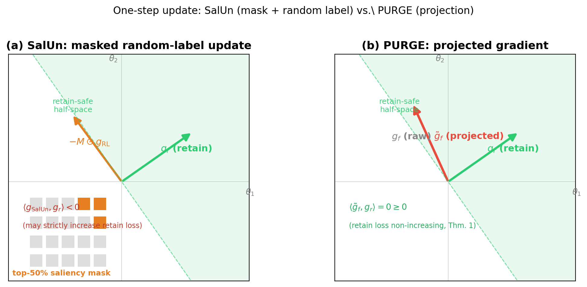
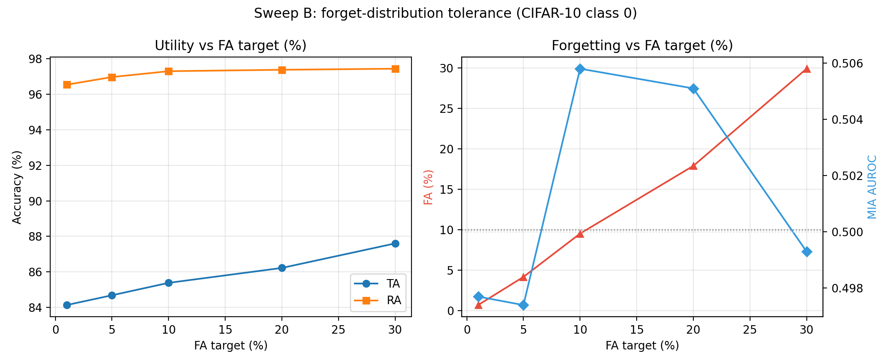

# PURGE

**Projected Unlearning via Retain-Guided Erasure**

[](https://www.python.org/downloads/)
[](https://pytorch.org/)
[](LICENSE)

PURGE adapts **A-GEM gradient projection** from continual learning to machine unlearning. Every update is projected onto the retain-safe half-space, giving a per-step guarantee that retain loss does not increase.

**Paper:** [`paper/purge_arxiv_final.pdf`](paper/purge_arxiv_final.pdf)

<p align="center">
  
</p>

---

## Highlights

| | |
|---|---|
| **Per-step retain safety** | A-GEM projection on every forget gradient |
| **Privacy–utility knob** | Sweep B: FA target 1% → TA 84.1%; target 30% → TA 87.6% |
| **BN diagnostic** | PURGE+BN vulnerable (ΔF +88pp); GroupNorm fix (ΔF = 0) |
| **5 datasets** | CIFAR-10, MNIST, SVHN, STL-10, PathMNIST · 22 forgetting tasks |

---

## Install

```bash
git clone https://github.com/vedjaw/la_purge.git && cd la_purge
python -m venv .venv && source .venv/bin/activate
pip install -r requirements.txt
```

**Requirements:** CUDA GPU recommended · datasets auto-download to `./data`

---

## Quick Start

```bash
# 1. Train base model (once)
bash scripts/train_base_cifar10.sh

# 2. Run PURGE unlearning
bash scripts/unlearn_cifar10.sh
```

Or directly:

```bash
python run.py --config configs/cifar10_kl_retain.yaml \
  --checkpoint ./checkpoints/base_cifar10_resnet18.pth \
  --data_dir ./data --save_dir ./checkpoints
```

**CIFAR-10 class 0 (3 seeds, paper headline):**

| TA | FA ↓ | RA | MIA |
|----|------|-----|-----|
| 85.2 ± 0.2 | 8.9 ± 0.6 | 97.2 ± 0.1 | 0.507 ± 0.001 |

---

## Repository Layout

```
la_purge/
├── run.py                  # Main PURGE implementation
├── configs/                # YAML configs
├── experiments/            # Paper experiment scripts
├── scripts/                # Shell wrappers
├── results/                # Published CSV summaries
├── images/                 # Paper figures
└── paper/                  # Manuscript + references
```

---

## Experiments

Full commands and expected outputs: **[docs/EXPERIMENTS.md](docs/EXPERIMENTS.md)**

| Script | Paper section | What it does |
|--------|---------------|--------------|
| `experiments/component_ablation.py` | Table: component isolation | −KD, −Rep, −Stopping, −Projection, selective-layer |
| `experiments/epsilon_sweep.py` | Sweep A & B | Retain-budget vs FA-target frontier |
| `experiments/bn_recalibration.py` | Finding 3 (BN) | BN-recalibration attack diagnostic |
| `experiments/train_groupnorm_base.py` | GroupNorm fix | Train GN backbone |
| `experiments/base_mia.py` | Finding 1 (MIA) | MIA on pre-unlearning base model |
| `experiments/linear_probe.py` | Finding 4 (probe) | Linear probe on penultimate features |
| `experiments/fid_baselines.py` | FID table | Feature-space Fréchet distance |

**One-liners:**

```bash
bash scripts/run_component_ablation.sh
bash scripts/run_epsilon_sweep.sh
bash scripts/run_epsilon_sweep.sh --only B
python experiments/base_mia.py --checkpoint checkpoints/base_cifar10_resnet18.pth
bash scripts/train_groupnorm_base.sh
```

---

## Key Results

### Component ablation (CIFAR-10, seed 42)

| Config | TA | FA | RA | MIA |
|--------|-----|-----|------|------|
| Full PURGE | 85.2 | 8.9 | 97.2 | 0.507 |
| −Projection | 79.69 | 6.0 | 90.77 | 0.511 |
| −KD | 81.35 | 6.52 | 92.67 | 0.510 |
| −Stopping | 81.03 | 0.0 | 92.26 | 0.532 |
| Selective-layer | 85.37 | 8.18 | 97.41 | 0.499 |

### Sweep B — privacy–utility frontier

<p align="center">
  
</p>

| FA target | TA | FA | RA | MIA |
|-----------|-----|-----|------|------|
| 1% | 84.13 | 0.68 | 96.54 | 0.498 |
| 10% | 85.38 | 9.52 | 97.30 | 0.506 |
| 30% | 87.60 | 29.92 | 97.44 | 0.499 |

### BN recalibration + GroupNorm fix

| Method | Pre-F | Post-F | ΔF |
|--------|-------|--------|-----|
| PURGE (BN) | 10.0% | 98.1% | **+88.1pp** |
| PURGE (GroupNorm) | 7.6% | 7.6% | **0.0pp** |
| SalUn / SCRUB / others | — | — | ≤ 0 |

---

## Hyperparameters

| Flag | Default | Description |
|------|---------|-------------|
| `--forget_objective` | `kl_retain` | `ga` / `kl_uniform` / `kl_retain` |
| `--retain_budget_factor` | `5.0` | Retain-loss budget ε_R |
| `--fa_target` | `10.0` | Forget-accuracy target ε_F (%) |
| `--kd_weight` | `2.0` | Knowledge distillation weight |
| `--rep_weight` | `0.05` | Representation erasure weight |
| `--disable_projection` | off | Ablation: skip A-GEM projection |
| `--freeze_early_layers` | off | Ablation: freeze conv1–layer2 |
| `--use_groupnorm` | off | Use GroupNorm backbone |

---

## Citation

```bibtex
@misc{purge2026,
  title  = {PURGE: Projected Unlearning via Retain-Guided Erasure},
  author = {Jawandhia, Vedant and Ahuja, Daksh and Siddiqui, Ghufran Alam and
            Trivedi, Prashant and Sinha, Yash and Narang, Pratik},
  year   = {2026},
  url    = {https://github.com/vedjaw/la_purge}
}
```

---

## License

MIT — see [LICENSE](LICENSE).
